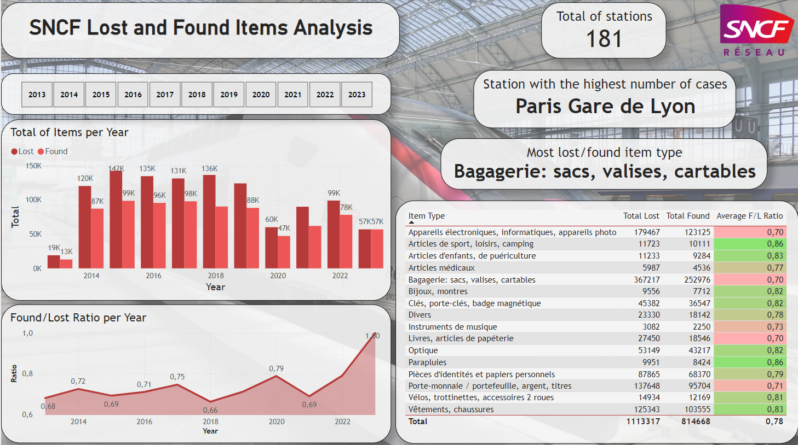

# SNCF Lost and Found Items

## Description

In this project, **SQL** was used to explore datasets, from French railway company SNCF, which contains information about lost and found items in almost all the train stations in France. These datasets are available at the open-source website from the company, found <a href="https://data.sncf.com/explore/?sort=modified" title="Download" download>here fr</a>.
After exploring and a bit of manipulation, the data was exported to a csv file and further manipulated in **Power BI**. Some new temporary tables and aggregate functions where used with the help of **PowerQuery**. Then, the data was visualized.

## Softwares

- SQL
- Power BI

## Code

In order to not pollute this repository, I left the program used in the repository files, which I invite you to take a look. 

## Power BI result

 

